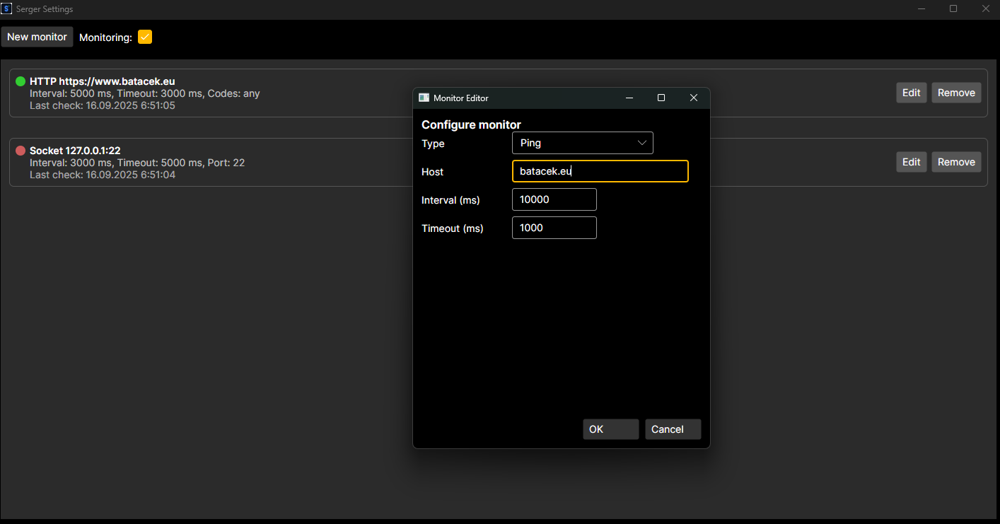

# Serger - Server Pinger

<h1>What is it for?</h1>
<i>Do you have some sort of server and you're worried about its availability? For example, do you have a website, and you're worried that your visitors won't be able to visit it?</i>
<b>This thing is for you!</b> 
This program will notify you if there are any troubles with your server. Right now it can only check if the server is reachable, but soon it will be able to check a lot more and get a lot more details for you.

<h1>Current features</h1>

- You can change the ping delay (default: 10 000 ms/10 s)
- You can choose between 2 languages (Czech and English)
    - You can easily translate it to another language or even enter your own messages
    - Not implemented yet in GUI
- You can ping any type of server
    - You can choose from 3 types of ping (Ping, Socket, HTTP)
- You can use our library for your own code or use our GUI application

<h1>Library</h1>
The library is written in C# using .NET9.0 and is not available on NuGet yet.
The library is now available in the <b>SRG_Core</b> folder.
The GUI will not be open source, but the CLI will stay open source as example code for the library.
Our custom license has been changed with the version 1.0.0 to make it more suitable for the Library and GUI.

<h1>Quick License Summary</h1>

> ⚠️ **Note:** This section is **not the official license**. This is just a user-friendly summary to help you understand the rules. The official licence always has the highest degree of validity, so do not use this for legal decisions.

- Only for personal and educational use.
- Redistribution or selling without the author’s permission is prohibited.
- If you have any doubts, please read the licence or contact the author.

<h1>GUI</h1>
The GUI is now simple Avalonia application.
The GUI is not (and will not be) open source.
The GUI is using different license than the library.

# ToDo
- ✅Logs
- ~~❌CLI commands~~ **(cancelled)**
- ✅Windows notifications
- ✅Windows tray icon
- ✅Languages (en, cs) - Not implemented yet in GUI
- ❌Wiki
- ✅️️GUI (Avalonia)
- ✅Linux support
- ❌Ping server software (1 server for pinging multiple IPs, sending notification to 1 computer)
- ❌API support
- ✅MacOS support

# Serger Team
- Maintainer and main developer: [Tomáš Barták](mailto:BartakTomas@batacek.eu) (GitHub: [Batacek](https://github.com/Batacek))
- Library Develeoper and translator: Natans Utevskis (GitHub: [nathutev](https://github.com/nathutev))
- GUI developer and MacOS tester: [Martin Balcar](mailto:raixo@raixo.cz) (GitHub: [raixo](github.com/raixo))

